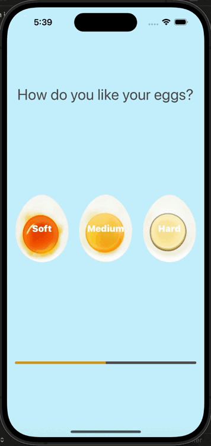

# Egg Timer

## Goal

The Egg Timer app is a user-friendly utility application designed to assist users in cooking eggs to their preferred level of doneness: soft, medium, or hard. Built using Swift, the app provides users with options to select their desired egg type and displays a countdown timer on a progress view. Upon completion of the timer, the app notifies users using AVFoundation to play a sound, signaling that the eggs are ready. Key features of the app include:

## Egg Doneness Selection 
The app offers users the choice to select their preferred level of egg doneness, including soft, medium, or hard. This customization ensures that users can cook their eggs to their exact preferences.

## Countdown Timer Display 
Upon selecting the desired egg type, the app initiates a countdown timer and displays it on a progress view. Users can monitor the progress of the timer visually, allowing them to gauge when their eggs will be ready.

## Notification with Alarm Sound: When the countdown timer reaches zero, the app notifies users using AVFoundation to play a sound. This audio cue signals that the cooking process is complete, ensuring that users do not forget about their eggs while they are cooking.

